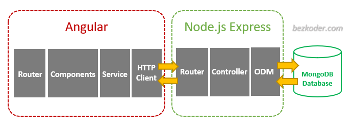

<h1 style="color: #1371C3; text-align: center; padding: 10px 0; border: 3px solid; text-transform: uppercase;">✈️ Senvol Project 🛠️</h1>

  

---

This is the `API` implementation for **Senvol** project. ___`Enjoy with the following lines`___ 😇

---
  

<h2 style="color: #1371C3; text-align: center; padding: 10px 0; border: 3px solid; text-transform: uppercase;">🛠️ MEAN Stack Architecture</h2>

---

We've built our application with following architecture:

**NodeJS Express** exports `REST APIs` and interacts with **MongoDB** Database using `Mongoose ODM`.

Angular Client sends `HTTP Requests` and retrieves `HTTP Responses` using `HTTPClient`, consume data on the **components**. Angular Router is used for navigating to pages.

<h2 style="color: #1371C3; text-align: center; padding: 10px 0; border: 3px solid; text-transform: uppercase;">🛠️ Backend Overview</h2>

---

These are APIs that Node.js Express App will export:

👇 AUTHENTICATION 🔐

| __METHODS__ | __URLS__              | __ACTIONS__      |
|-------------|-----------------------|------------------|
| `POST`      | api/auth/register     | Registration     |
| `POST`      | api/auth/register     | Login            |

👇 USER 👨‍⚖️

| __METHODS__ | __URLS__       | __ACTIONS__       |
|-------------|----------------|-------------------|
| `GET`       | api/users      | Get All Users     |
| `GET`       | api/users/:id  | Get User By Id    |
| `PUT`       | api/users/:id  | Update User By Id |
| `DELETE`    | api/users/:id  | Delete User By Id |

👇 FLIGHT ✈️

| __METHODS__ | __URLS__        | __ACTIONS__         |
|-------------|-----------------|---------------------|
| `GET`       | api/flights     | Get All Flight      |
| `GET`       | api/flights/:id | Get Flight By Id    |
| `POST`      | api/flights     | Add New Flight      |
| `PUT`       | api/flights/:id | Update Flight By Id |
| `DELETE`    | api/flights/:id | Delete Flight By Id |

👇 RESERVATION 📋

| __METHODS__ | __URLS__                    | __ACTIONS__              |
|-------------|-----------------------------|--------------------------|
| `GET`       | api/reservations            | Get All Reservation      |
| `GET`       | api/reservations/show/:id   | Get Reservation By Id    |
| `POST`      | api/reservations            | Add New Reservation      |
| `PUT`       | api/reservations/edit/:id   | Update Reservation By Id |
| `DELETE`    | api/reservations/delete/:id | Delete Reservation By Id |

👇 DESTINATION ✈️

| __METHODS__ | __URLS__             | __ACTIONS__              |
|-------------|----------------------|--------------------------|
| `GET`       | api/destinations     | Get All Destination      |
| `GET`       | api/destinations/:id | Get Destination By Id    |
| `POST`      | api/destinations     | Add New Destination      |
| `PUT`       | api/destinations/:id | Update Destination By Id |
| `DELETE`    | api/destinations/:id | Delete Destination By Id |